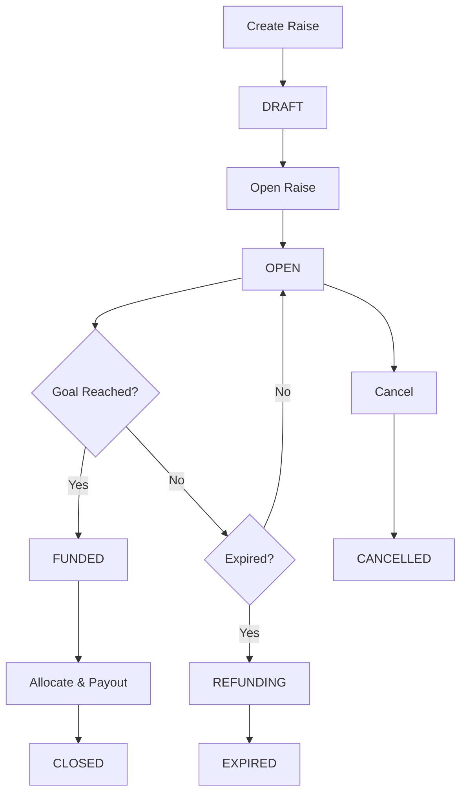

# Investment Pool (Raise) System

## Overview

The Investment Pool system enables businesses to create goal-based fundraising campaigns where investors can contribute until a funding goal is reached. Once funded, the system automatically allocates ownership/notes/royalty shares and releases funds to the business.

## Architecture

### Core Components

```
/app/(raises)/**          # Investor-facing pages
/app/business/raises/**   # Business management pages
/app/api/raise/**         # REST API endpoints
/lib/raise/**            # Domain logic and services
/lib/payments/**         # Stripe integration
/lib/kyc/**              # KYC/KYB verification
/lib/alloc/**            # Allocation calculations
/lib/db/**               # Database adapter
```

### Data Flow

1. **Business creates raise** → Draft status
2. **Business opens raise** → Open status, visible to investors
3. **Investors contribute** → PaymentIntents created, funds held in escrow
4. **Goal reached** → Automatic allocation and payout
5. **Goal not reached by expiry** → Automatic refunds

## Data Model

### Core Entities

#### Raise
- `id`: Unique identifier
- `businessId`: Business owner
- `title`: Campaign title
- `goalCents`: Funding target in cents
- `minContributionCents`: Minimum investment amount
- `maxContributionCents`: Maximum per-investor limit
- `instrument`: EQUITY | INTEREST | ROYALTY
- `instrumentTermsJson`: Terms specific to instrument type
- `status`: DRAFT | OPEN | FUNDED | CLOSED | CANCELLED | EXPIRED | REFUNDING
- `raisedCents`: Current funding amount
- `expiresAt`: Campaign deadline

#### Investment
- `id`: Unique identifier
- `raiseId`: Associated raise
- `investorId`: Investor identifier
- `amountCents`: Investment amount
- `status`: PENDING | AUTHORIZED | CAPTURED | REFUNDED | FAILED
- `paymentProviderId`: Stripe PaymentIntent ID

#### Allocation
- `id`: Unique identifier
- `raiseId`: Associated raise
- `investorId`: Investor identifier
- `allocationJson`: Instrument-specific allocation details
- `certificateNumber`: Unique certificate identifier

#### BusinessPayout
- `id`: Unique identifier
- `raiseId`: Associated raise
- `amountCents`: Net payout amount (after platform fees)
- `status`: PENDING | RELEASED | FAILED
- `providerTransferId`: Stripe transfer ID

## Instrument Types

### Equity
- **Terms**: `equityPoolPct` (percentage of company equity to offer)
- **Allocation**: Each investor receives `(investment / total) * equityPoolPct`
- **Example**: 20% equity pool, $10k investment out of $100k total = 2% ownership

### Interest (Debt Note)
- **Terms**: `interestAPR` (annual percentage rate), `termMonths` (loan duration)
- **Allocation**: Each investor receives a debt note with principal = investment amount
- **Example**: 8% APR, 36-month term, $5k investment = $5k principal note at 8% APR

### Royalty
- **Terms**: `royaltyPoolPct` (percentage of revenue to share), `royaltyDurationMonths` (duration)
- **Allocation**: Each investor receives `(investment / total) * royaltyPoolPct`
- **Example**: 5% royalty pool, $20k investment out of $200k total = 0.5% revenue share

## API Endpoints

### Public Endpoints

#### `GET /api/raise`
List open raises for investors
- Query params: `status`, `limit`, `offset`
- Returns: Paginated list of raises with progress details

#### `GET /api/raise/[id]`
Get raise details for investment
- Returns: Raise details, progress, investment limits

#### `POST /api/raise/[id]/invest`
Initiate investment
- Body: `{ amountCents: number }`
- Returns: Stripe PaymentIntent details

### Business Endpoints

#### `POST /api/raise`
Create new raise
- Body: Full raise configuration
- Returns: Created raise object

#### `PUT /api/raise/[id]`
Update raise (admin actions)
- Body: `{ action: 'open' | 'cancel' | 'extend', newExpiresAt?: string }`

### Webhook Endpoints

#### `POST /api/payments/webhook`
Stripe webhook handler
- Handles: `payment_intent.succeeded`, `payment_intent.failed`, `charge.refunded`
- Updates investment status and triggers allocation when goal reached

## Business Logic

### Raise Lifecycle



### Investment Processing

1. **Validation**: Check min/max limits, raise status, expiration
2. **PaymentIntent Creation**: Stripe PaymentIntent with manual capture
3. **Investment Record**: Create pending investment record
4. **Webhook Processing**: Update status on payment success
5. **Goal Check**: Auto-allocate and payout if goal reached

### Allocation Process

1. **KYC/KYB Verification**: Ensure all parties verified
2. **Calculation**: Compute allocations based on instrument type
3. **Allocation Records**: Create allocation certificates
4. **Business Payout**: Transfer net amount (after platform fees)
5. **Notifications**: Send allocation certificates to investors

### Refund Process

1. **Expiration Check**: Detect expired raises with unmet goals
2. **Investment Refunds**: Process Stripe refunds for captured payments
3. **Status Updates**: Mark investments as refunded
4. **Completion**: Mark raise as expired when all refunds processed

## Configuration

### Environment Variables

```bash
# Stripe Configuration
STRIPE_SECRET_KEY=sk_test_...
STRIPE_WEBHOOK_SECRET=whsec_...
NEXT_PUBLIC_STRIPE_PUBLISHABLE_KEY=pk_test_...

# Database
NEXT_PUBLIC_SHEETDB_PUBLIC_API_URL=https://sheetdb.io/api/v1/YOUR_SHEET_ID
SHEETDB_API_KEY=your_sheetdb_api_key

# Platform Settings
PLATFORM_FEE_BPS=300  # 3.00%
CLIP_TO_REMAINING=true
AUTO_CLOSE_DELAY_MS=5000
```

### Allocation Configuration

```typescript
const config = {
  EQUITY_ROUNDING_DECIMALS: 4,     // Round equity to 0.0001%
  ROYALTY_ROUNDING_DECIMALS: 6,    // Round royalty to 0.000001%
  PLATFORM_FEE_BPS: 300,           // 3.00% platform fee
  CERTIFICATE_PREFIX: 'HOO'        // Certificate number prefix
};
```

## Security & Compliance

### KYC/KYB Integration

- **Investor Verification**: Required for investments over $100
- **Business Verification**: Required before payout
- **Accreditation**: Required for investments over $1,000
- **Compliance Gates**: All parties must be verified before funds release

### Payment Security

- **Idempotency**: All payment operations use idempotency keys
- **Webhook Verification**: Stripe signature verification
- **Manual Capture**: Funds held until goal reached
- **Escrow**: Funds held in Stripe until allocation complete

### Audit Trail

- **AuditLog**: All state changes logged with timestamps
- **Webhook Events**: All Stripe events logged
- **Investment History**: Complete investment lifecycle tracked

## Testing

### Unit Tests

```bash
npm test lib/alloc/__tests__/engine.test.ts
```

Tests cover:
- Equity allocation calculations and rounding
- Interest note creation with correct terms
- Royalty percentage calculations
- Platform fee calculations
- Edge cases and error conditions
- Configuration validation

### Integration Tests

```bash
npm test __tests__/integration/raise.test.ts
```

Tests cover:
- Complete raise lifecycle
- Payment webhook processing
- Allocation and payout flow
- Refund processing

## Deployment

### Prerequisites

1. **Stripe Account**: Test mode enabled
2. **SheetsDB Setup**: Google Sheet with proper headers
3. **Environment Variables**: All required variables set
4. **Webhook Configuration**: Stripe webhooks pointing to production URL

### Google Sheet Headers

```csv
id,businessId,title,description,goalCents,minContributionCents,maxContributionCents,instrument,instrumentTermsJson,status,raisedCents,expiresAt,createdAt,updatedAt
id,raiseId,investorId,amountCents,status,paymentProviderId,createdAt,updatedAt
id,raiseId,investorId,allocationJson,certificateNumber,createdAt
id,raiseId,amountCents,status,providerTransferId,createdAt,updatedAt
id,type,payloadJson,createdAt
```

### Stripe Webhook Events

Configure these events in Stripe dashboard:
- `payment_intent.succeeded`
- `payment_intent.payment_failed`
- `payment_intent.canceled`
- `charge.refunded`
- `charge.dispute.created`

### Production Checklist

- [ ] Stripe test mode disabled
- [ ] Real KYC/KYB provider integrated
- [ ] Connected accounts set up for businesses
- [ ] Webhook endpoints secured
- [ ] Audit logging configured
- [ ] Error monitoring enabled
- [ ] Backup procedures in place

## Monitoring & Operations

### Key Metrics

- **Funding Success Rate**: % of raises that meet their goals
- **Average Time to Fund**: Time from open to funded
- **Platform Revenue**: Total fees collected
- **Refund Rate**: % of raises that expire unfunded
- **Allocation Accuracy**: Verification of allocation calculations

### Alerts

- **Failed Payments**: PaymentIntent failures
- **Webhook Failures**: Failed webhook processing
- **Allocation Errors**: Failed allocation calculations
- **Payout Failures**: Failed business payouts
- **Refund Failures**: Failed refund processing

### Maintenance

- **Daily**: Check for stuck raises in REFUNDING state
- **Weekly**: Review failed allocations and retry
- **Monthly**: Audit allocation calculations
- **Quarterly**: Review platform fee structure

## Future Enhancements

### Escrow Provider Adapter

Replace Stripe escrow with dedicated escrow provider:

```typescript
interface EscrowProvider {
  createEscrowAccount(amount: number, parties: string[]): Promise<string>;
  releaseFunds(escrowId: string, recipients: Recipient[]): Promise<void>;
  refundEscrow(escrowId: string): Promise<void>;
}
```

### Advanced Features

- **Multi-round Funding**: Series A, B, C progression
- **Investor Accreditation**: Automated accreditation verification
- **Secondary Market**: Trade allocations between investors
- **Reporting**: Automated investor updates and financial reporting
- **Compliance**: SEC filing automation for Reg CF/A+ offerings

### Performance Optimizations

- **Caching**: Redis for raise details and progress
- **Queue System**: Background processing for allocations
- **Database**: Migrate from SheetsDB to PostgreSQL
- **CDN**: Static asset optimization
- **Monitoring**: APM integration for performance tracking
